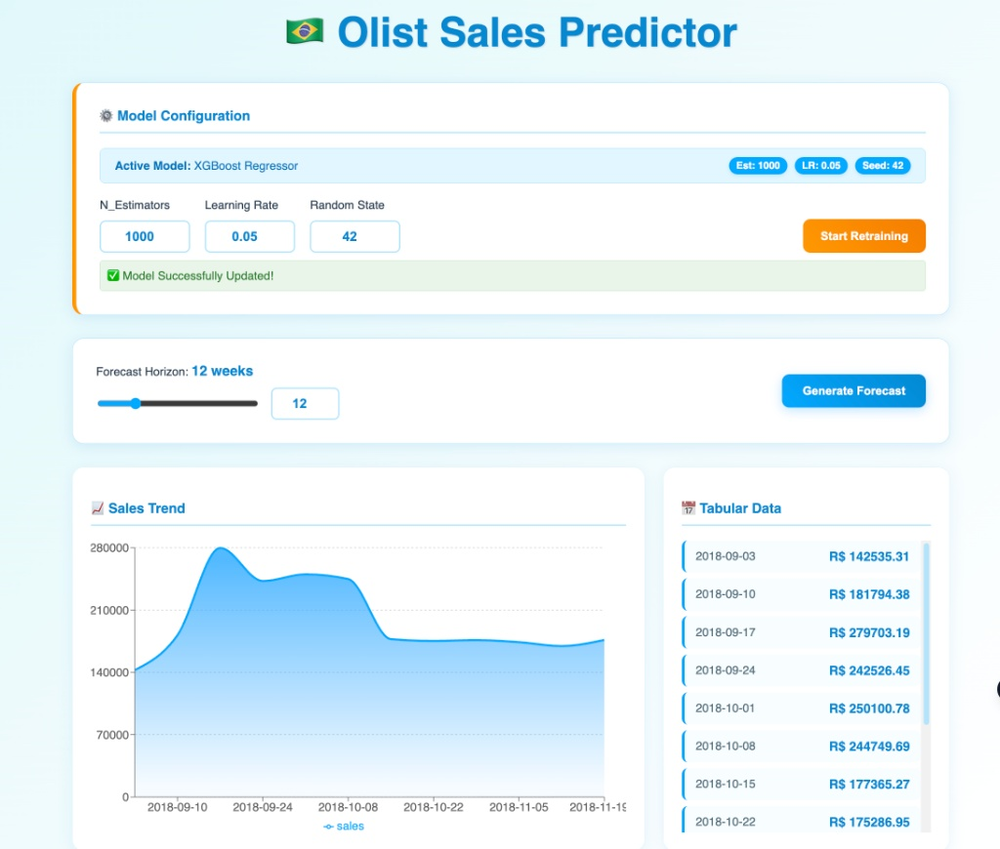

# 🇧🇷 Olist Sales Predictor: End-to-End ML System



## 📋 Overview

This project is a **Full-Stack Machine Learning Application** designed to forecast weekly sales for the Olist E-Commerce platform.

Unlike static notebooks, this is a production-ready system featuring a decoupled architecture. It consists of a **Python/FastAPI** backend that handles inference and retraining, and a **React.js** frontend that allows stakeholders to interact with the model, visualize forecasts, and trigger model updates.

## 🏗 Architecture

The application follows a Microservices pattern:

- **Frontend (Client):** Built with **React (Vite)** and **Recharts**. It manages state, handles user inputs (sliders/text), and polls the backend for updates.
- **Backend (Server):** Built with **FastAPI**. It serves as the REST API layer, handling validation (Pydantic), request queuing (BackgroundTasks), and CORS.
- **ML Engine:** **XGBoost Regressor** trained on historical Olist data (2016–2018).
- **Forecasting Strategy:** Uses a **Recursive Multi-Step** strategy. The model predicts one week ahead, updates the sliding window features (Lags, Rolling Means), and uses that prediction to forecast the subsequent week.

## ✨ Key Features

### 1. Interactive Forecasting

- Dynamic horizon selection.
- Real-time visualization using Gradient Area Charts.
- Tabular breakdown of specific revenue targets.

### 2. MLOps & Retraining

- **No-Code Retraining:** A dedicated admin panel allows users to tune hyperparameters (`n_estimators`, `learning_rate`, `random_state`) via the UI.
- **Background Processing:** Training runs as a non-blocking background task in FastAPI to ensure UI responsiveness.
- **Hot-Swapping:** The backend automatically reloads the new model artifact (`.pkl`) into memory without requiring a server restart.

### 3. API Observability

- `/config` endpoint exposes the currently active model parameters, ensuring the frontend always displays the true state of the production model.

## 🛠 Tech Stack

| Component           | Technology             | Role                      |
| :------------------ | :--------------------- | :------------------------ |
| **Language** | Python 3.10+           | Core Logic & ML           |
| **ML Library** | XGBoost / Scikit-Learn | Predictive Modeling       |
| **API Framework** | FastAPI / Uvicorn      | REST API & Async Server   |
| **Data Processing** | Pandas / NumPy         | Time Series Aggregation   |
| **Frontend** | React.js (Vite)        | User Interface            |
| **Visualization** | Recharts               | Data Plotting             |
| **Infrastructure** | Docker / Compose       | Containerization          |
| **Serialization** | Joblib                 | Model Artifact Management |

##  How to Run Locally

### Docker (Recommended) 

The easiest way to run the application is using the included container orchestration. This spins up both the API and the Client in isolated environments.

1. **Prerequisites:** Ensure Docker Desktop is installed and running.
2. **Build and Run:**
   ```bash
   docker-compose up --build

3. **Access Services:**

    Frontend Dashboard: http://localhost:5173
    Backend Server: http://localhost:8000